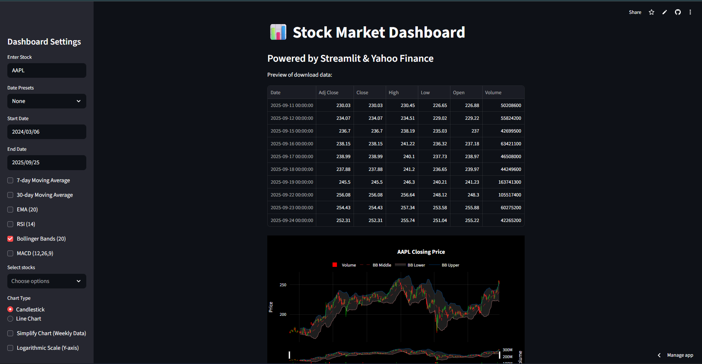
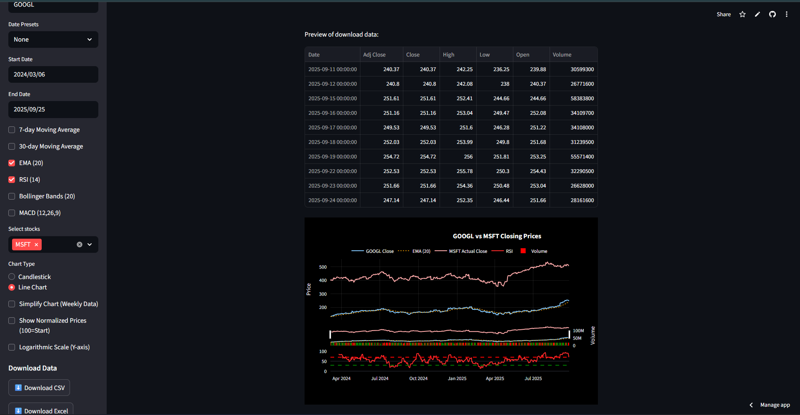

# 📊 Stock Market Dashboard

A fully interactive **Stock Market Dashboard** built with [Streamlit](https://streamlit.io), [yfinance](https://pypi.org/project/yfinance/), and [Plotly](https://plotly.com/python/).  

This app lets you:
- Fetch historical stock data  
- Visualize **candlestick** and **line charts**  
- Apply technical indicators (**RSI, MACD, Bollinger Bands, Moving Averages**)  
- Download data in **CSV/Excel** formats  

---

## 🚀 Live Demo
👉 [Launch the app on Streamlit Cloud](https://stocks-market-dashboard.streamlit.app/)

---

## 📸 Screenshots

### 📌 Dashboard Example


### 📌 Technical Indicators
  

---

## ✨ Features
- 📈 Real-time stock data with **Yahoo Finance**
- 🔥 Interactive **Candlestick** and **Line Charts**
- ⚡ Technical Indicators:
  - 7-day / 30-day Moving Averages
  - EMA (20)
  - RSI (14)
  - Bollinger Bands (20)
  - MACD (12,26,9)
- 🔄 Compare multiple tickers
- 📥 Export data as **CSV** or **Excel**
- 🌗 Dark theme with customizable chart options

---

## 🛠️ Installation (Local Development)

Clone the repository:

```bash
git clone https://github.com/UwaifoObed/Stock-Dashboard.git
cd stock-dashboard
```

Create a virtual environment and install dependencies:

```bash
pip install -r requirements.txt
```

Run the app:

```bash
streamlit run app.py
```

---

## 📦 Deployment

This app is deployed using **Streamlit Cloud**.  
To deploy your own version:

1. Fork this repository  
2. Connect your repo to **Streamlit Cloud**  
3. Ensure you have `requirements.txt` (and `runtime.txt` if needed)  

---

## 📜 License
This project is licensed under the **MIT License**.
